# pyrobot Class Diagram

---
title : allegro_hand
---
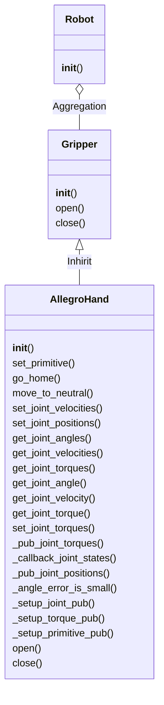

---
title : azure_kinect
---
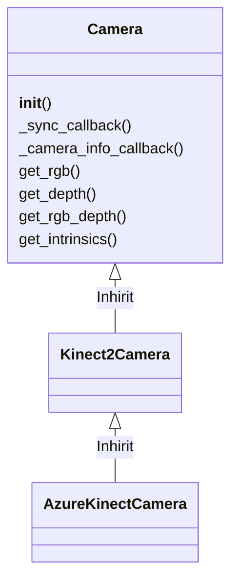

---
title : core
---
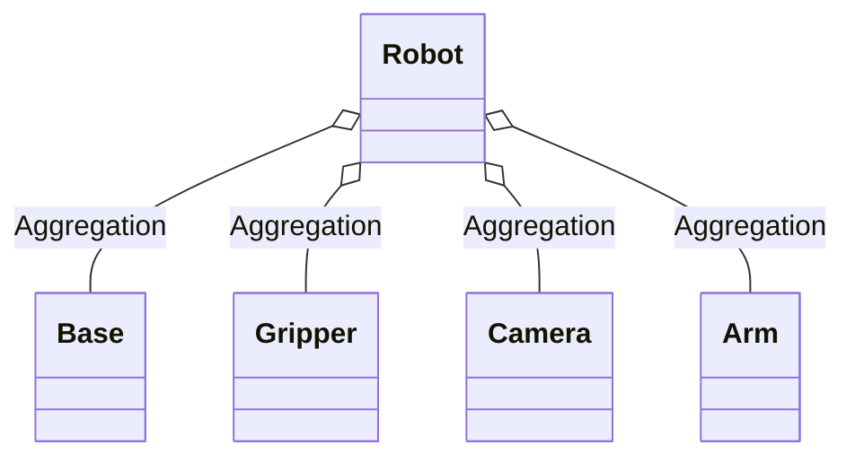

---
title : habitat
---
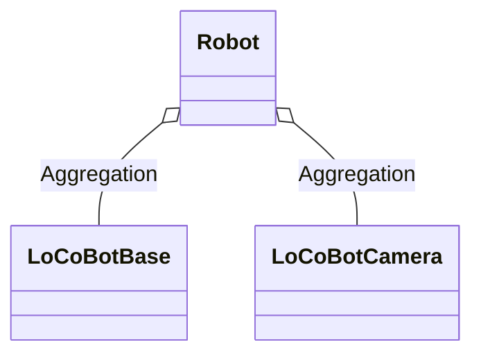

---
title : kinect2
---
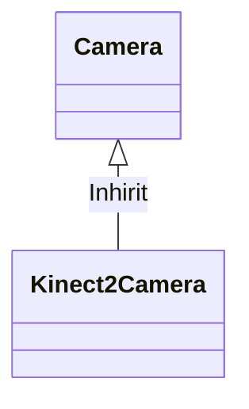

---
title : locobot
---
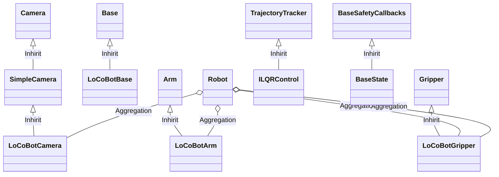

---
title : sawyer
---
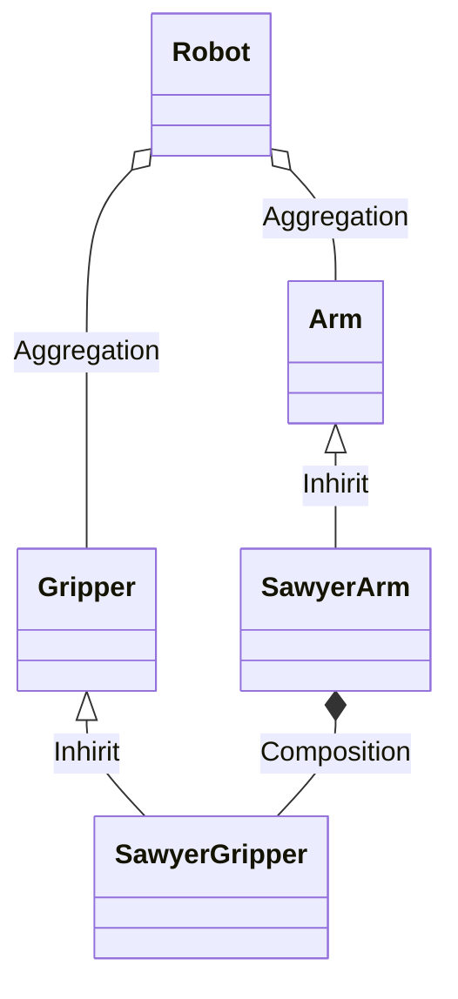

---
title : ur5
---
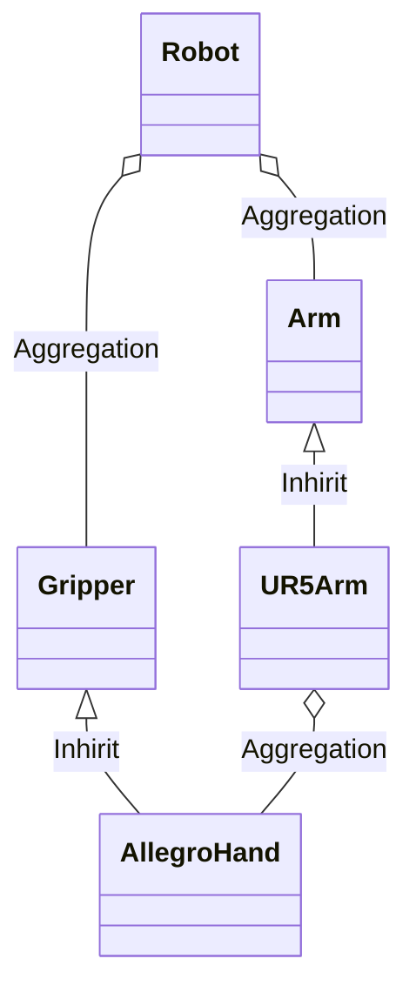

---
title : ur5
---
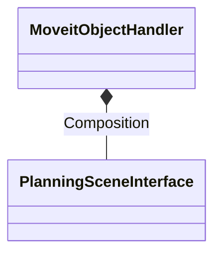

---
title : vrep_locobot
---
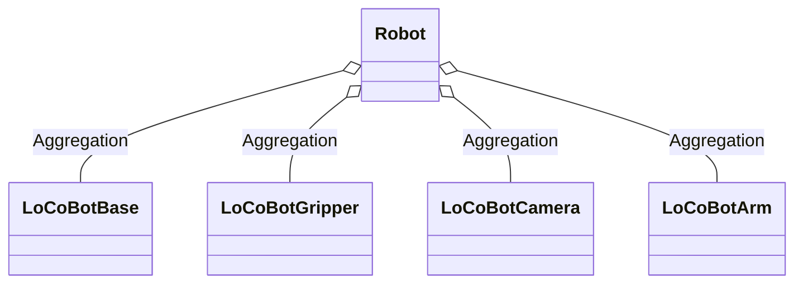

---
title : vx300s
---
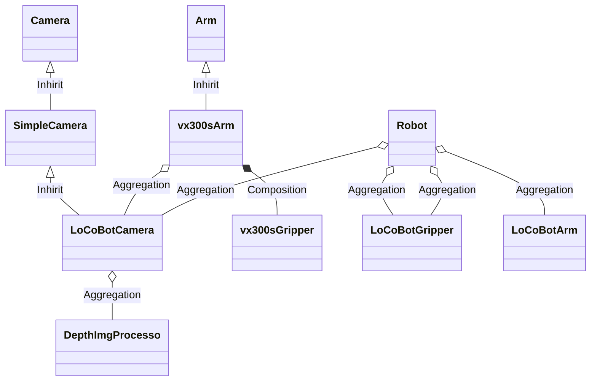

